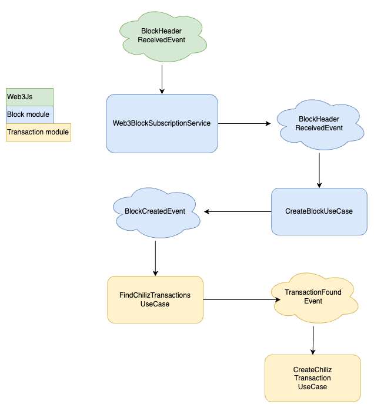

# Chindexer App

This repository contains the resolution to the Chiliz proposed test.

# Table of Contents
- [Requirements](#requirements)
- [Solution](#solution)
  - [Tech Stack](#tech-stack)
  - [App Architecture](#app-architecture)
  - [How it works](#how-it-works)
    - [First start](#first-start)
    - [Downtime for maintainance](#downtime-for-maintainance)
    - [Endpoints](#endpoints)
  - [Usage](#usage)


# Requirements

- Write a NodeJs program that could index the Ethereum blockchain in real time and could be started from any block height.
- Watch and store any transaction interacting with the CHZ token smart contract (use any appropriate DB).
- Provide two private API endpoints (no need for authentication)
  - One that would allow a user to retrieve the total amount of CHZ transferred (since
  the start of the program)
  - One that would return whether a transaction is interacting with the CHZ token smart
  contract or not given its transaction hash (transaction older than the program is possible)

- This indexer needs to be resilient (ie: what happens if it needs to be stopped for maintenance?)

CHZ Token : 0x3506424f91fd33084466f402d5d97f05f8e3b4af

# Solution

The implemented solution solves the problem in a simple and straightforward way and could be reused for any ERC20 token transaction monitoring. 

*Please note this has been developed relatively quickly so there are improvements and technical debt that could be added in the future.*

## Tech Stack

Based on the test requirements, I have chosen the following technology stack:

- **NodeJs** (mandatory)
- **TypeScript**
- **NestJs**: development framework chosen for its familiarity and versatility to develop applications.
- **MongoDB**: has been the database of choice due to the unstructured nature of the data to be stored (the list of blocks and network transactions).
- **Docker**: as a means to develop the infrastructure of the application
- **Web3Js**: the blockchain development library
- **Infura**: the blockchain provider

## App Architecture

Regarding the architecture of the application, I have opted for a modular approach consisting of the following modules:

- **Block**: contains all the logic related to block processing (subscribe to new blocks and create new block).
- **Transaction**: contains all the logic related to transaction filtering and storage.
- **Shared**: contains shared logic between both block and transaction modules.

Within each module, I have chosen to apply a hexagonal architecture in order to protect the business logic from the technical details of the infrastructure. Thus, the following layers can be observed:

- **Domain**: is the heart of the application and contains the models, ports and events
- **Application**: contains the use cases of the application
- **Infrastructure**: here are the implementations of the domain ports and the more technological details or dependent frameworks (database, connection with blokchain, etc.).

> As you can see, the domain contains hardly any business logic. This is due to the nature of the use case and the speed at which I developed the application. I also decided to opt for this type of architecture instead of other simpler ones (layered architecture with active record) to demonstrate my knowledge of Clean Architectures and to take advantage of the isolation of the infrastructure in its own layer.

Finally, it should be noted that the communication between modules has been done through events (**Event-Driven Architecture**) looking for the maximum possible decoupling. Although I have used the module provided by NestJs out-of-the-box (`EventEmitterModule`), this approach could be extended and improved by integrating a message broker like Kafka or RabbitMQ.

## How it works

The general operation of the application is very simple: process each of the new blocks published on the Ethereum network and store transactions against the Chiliz token.

The following diagram summarizes this behavior:



0. `Web3BlockSubscriptionService` starts a subscription to `newBlockHeaders` in order to receive new mined blocks
1. `Web3BlockSubscriptionService` receives a new block event via subscription and publishes the `BlockHeaderReceivedEvent` event
2. This event is then processed by the : the block is stored in the database and `BlockCreatedEvent` is published.
3. `FindChilizTransactionsUseCase` filters the transactions in the block and publishes `TransactionFoundEvent` for each transaction against the Chiliz token.
4. Finally, `CreateChilizTransactionUseCase` retrieves the relevant information from the transaction log (from, to, value) and stores the data in the database.

### Start from block

In case you want to start the application from a specific block, it is possible to add the value of the block to the application configuration (`.env` file):

```
START_BLOCK=19496388
```

On start, the application will search for past transactions between start block and latest block (queried to the blockchain):

```Typescript
const options = {
  fromBlock: Web3.utils.numberToHex(startBlock),
  toBlock: 'latest',
  address: this.configService.get<string>('CHZ_TOKEN'),
};
const pastLogs = await this.web3.eth.getPastLogs(options);
```


> `START_BLOCK` is only taken into account if it is the first time the application is started, in other words, there are no blocks stored in the database.

### Downtime for maintainance

In order not to miss any transaction due to the maintenance of the application or any other unforeseen event, a mechanism has been implemented to obtain the transactions that occurred between the last processed block and the last block of the blockchain. 

This is done in the same way as we have seen in the previous section.(see `Web3BlockSubscriptionAdaptor.retrivePastTransactions()` for more details).

### Endpoints

A single controller (`TransactionController`) has been implemented with two exposed endpoints:

#### Is Chiliz Transaction

This endpoint returns true if a transaction is interacting with the CHZ token smart based on its transaction hash. 

In order to answer quickly and avoid unnecesary calls to the blockchain, it first checks if the transction is stored in the database (it has been processed) and only if it's not found there, the blockchain is queried (`IsChilizTransactionUseCase`):

```Typescript
async execute(hash: string): Promise<boolean> {
  return (
    (await this.isTransactionInDb(hash)) ||
    (await this.isTransactionInBlockchain(hash))
  );
}

async isTransactionInDb(hash: string): Promise<boolean> {
  const transaction = await this.transactionRepository.findOneByHash(hash);
  return transaction != null;
}

async isTransactionInBlockchain(hash: string): Promise<boolean> {
  const transactionReceipt =
    await this.blockchainRepository.getTransactionReceipt(hash);
  return (
    transactionReceipt.to === this.configService.get<string>('CHZ_TOKEN')
  );
}
```

#### Ge Total Amount

This endpoint returns the total amount of CHZ transferred that has been processed by the application. To take advantage of the mongo features, an aggregation function has been used to add all the value of stored transactions (`GetTotalAmountUseCase` and `TransactionRepository.getTotalAmount()`):

```Typescript
async getTotalAmount(): Promise<number> {
  const amount = await this.transactionModel.aggregate([
    { $group: { _id: null, amount: { $sum: '$value' } } },
  ]);
  return amount[0].amount;
}
```

## Usage

### Installation

```bash
  yarn install
```

### Execute test

```bash
  yarn test
```

### Configuration

Required configuration is done in `.env` file. All values are mandatory except `START_BLOCK`. Example:
```
CHZ_TOKEN=0x3506424f91fd33084466f402d5d97f05f8e3b4af
INFURA_API_KEY=<YOUR_INFURA_API_KEY>
ETHEREUM_URL=wss://mainnet.infura.io/ws/v3/
MONGODB_URI=mongodb://localhost/chindexer
START_BLOCK=19496388
```

### Running the app

Start the docker containers to run a MongoDB container for storage and  mongo-express container for to access database data in a simple way:

```bash
  docker-compose up -d
```

Run the application
```bash
  yarn start
```
